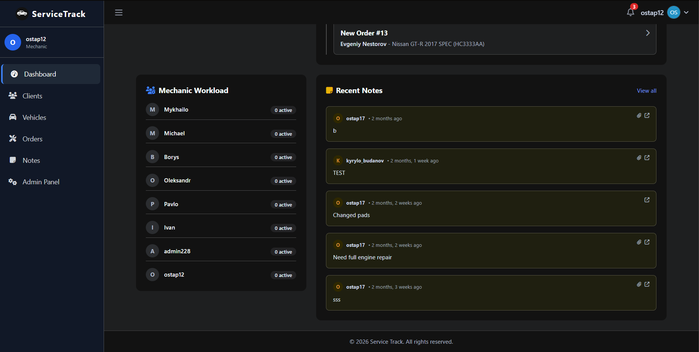
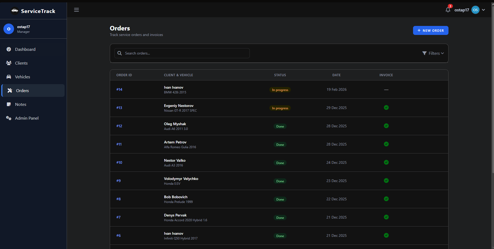
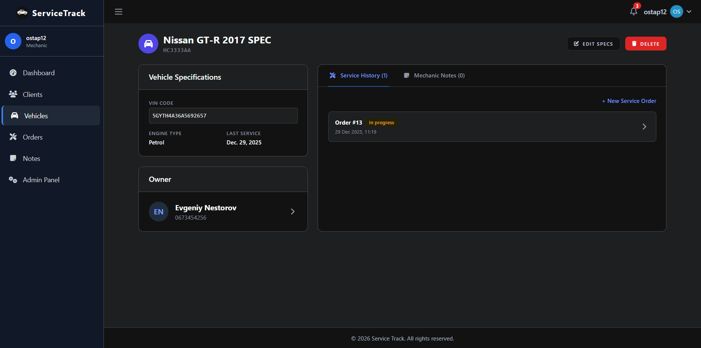
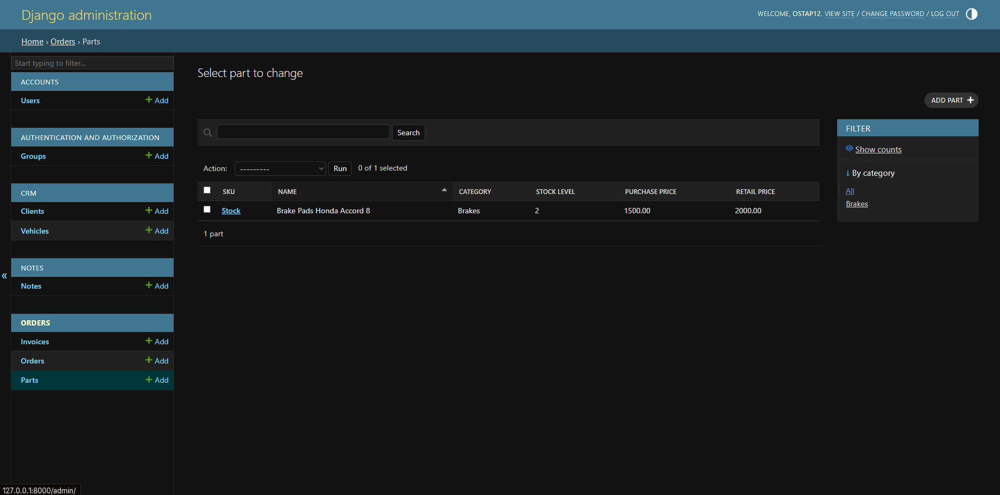
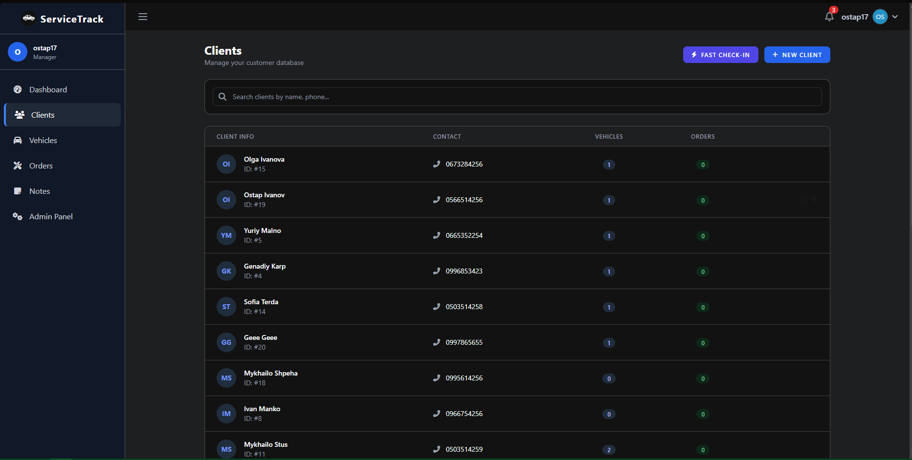
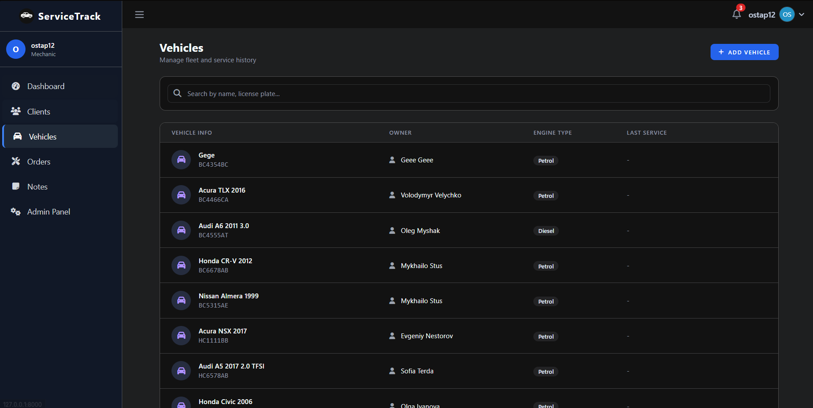
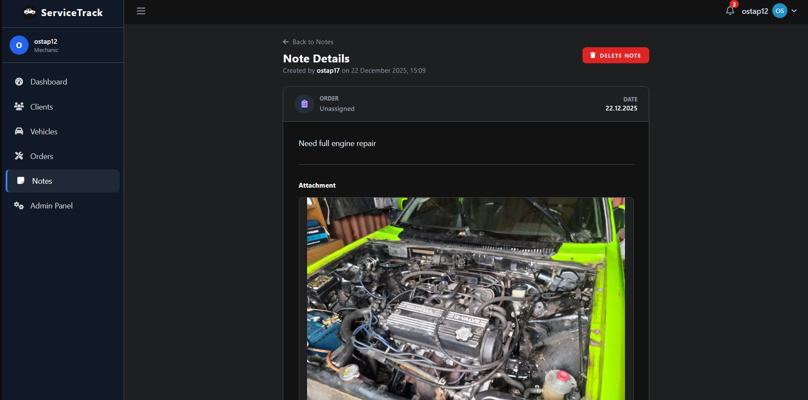

# Service Track (CRM)

Service Track is a professional CRM system tailored for auto repair shops. It streamlines the entire service lifecycle—from client intake and vehicle tracking to inventory management and final invoicing. Designed specifically for auto service employees, it prioritizes operational efficiency and clear internal communication.

## 🚀 Key Features

### 🛠 Service & Order Management
*   **Flexible Invoicing:** Move beyond fixed coefficients. Calculate costs based on actual `labor_hours`, `hourly_rates`, and total parts used.
*   **Order Assignments:** Assign mechanics to specific orders to track workload and accountability.
*   **Mileage Tracking:** Record vehicle mileage at each service visit for accurate maintenance history.
*   **Contextual Notes:** Mechanics can attach notes and images directly to **Orders**, providing a historical record of every repair.

### 📦 Inventory & Parts (Car-Parts)
*   **Full Parts Catalog:** Track parts by SKU, category, purchase price, and retail price.
*   **Automated Stock Deduction:** Parts are automatically deducted from inventory when an order is marked as **Done**.
*   **Low Stock Alerts:** Get real-time dashboard notifications when critical parts fall below threshold levels.

### 📊 Advanced Dashboard
*   **Action Banners:** Immediate visibility into orders requiring clarification to prevent workshop bottlenecks.
*   **Mechanic Workload:** Monitor the number of active orders per staff member to balance tasks effectively.
*   **Recent Activity Feed:** Stay updated with a live stream of new orders and the latest mechanic notes.

---

## 🛠 Tech Stack

*   **Backend:** Python 3, Django 6.0
*   **Frontend:** HTMX, Tailwind CSS, AdminLTE 3 (Bootstrap 4)
*   **Database:** SQLite (Development), PostgreSQL (Production)
*   **Tools & Utilities:**
    *   `ruff`: High-performance Python linting and formatting.
    *   `django-simple-history`: Comprehensive audit logs for every model change.
    *   `django-filter` & `django-crispy-forms`: Enhanced search and professional form layouts.
    *   `cloudinary`: Cloud-based media management for technical photos.

---

## 💻 Getting Started

### Installation

1.  **Clone the repository:**
    ```shell
    git clone https://github.com/ostapshpeha/py-service-track.git
    cd py-service-track
    ```

2.  **Set up environment:**
    ```shell
    python3 -m venv .venv
    source .venv/bin/activate  # Windows: .venv\Scripts\activate
    pip install -r requirements.txt
    ```

3.  **Initialize database:**
    ```shell
    python manage.py migrate
    python manage.py createsuperuser  # Create your administrative account
    ```

4.  **Run development server:**
    ```shell
    python manage.py runserver
    ```

### Default Demo Roles
| Role | Username | Password | Permissions |
|------|----------|----------|-------------|
| **Manager** | `kyrylo_budanov` | `Qwerty2002` | Full CRUD + Account Management |
| **Mechanic** | `borys_ivanov` | `Qwerty2002` | Full CRUD |

---

## 📸 Interface Preview

<details>
<summary><b>Click to expand Screenshot Gallery</b></summary>

### Dashboard & Analytics

*Real-time alerts, workload tracking, and inventory status.*

### Orders & Invoicing


*Detailed service tracking and professional cost breakdowns.*

### Inventory Management

*Car-parts catalog and stock level monitoring.*

### Client & Vehicle Management


*Centralized database for customers and their service history.*

### Technical Notes

*Mechanic findings with image attachments linked to service orders.*

</details>

---

## ⚙️ Configuration

The project uses environment variables for secure configuration. Copy `.env.sample` to `.env` and fill in your details.

| Variable | Description |
|----------|-------------|
| `DEBUG` | Set to `False` in production. |
| `SECRET_KEY` | Your unique Django secret key. |
| `CLOUDINARY_URL` | API credentials for image hosting. |
| `DATABASE_URL` | Connection string for PostgreSQL (Production). |

---

## 🤝 Contributing

Contributions are what make the open source community such an amazing place to learn, inspire, and create.

1. Fork the Project
2. Create your Feature Branch (`git checkout -b feature/AmazingFeature`)
3. Commit your Changes (`git commit -m 'Add some AmazingFeature'`)
4. Push to the Branch (`git push origin feature/AmazingFeature`)
5. Open a Pull Request

---

## 🔗 Links

- **Repository:** [https://github.com/ostapshpeha/py-service-track](https://github.com/ostapshpeha/py-service-track)
- **Issue Tracker:** [Report a bug](https://github.com/ostapshpeha/py-service-track/issues)
- **Security:** Contact `stark.ost17@gmail.com` for sensitive vulnerabilities.
