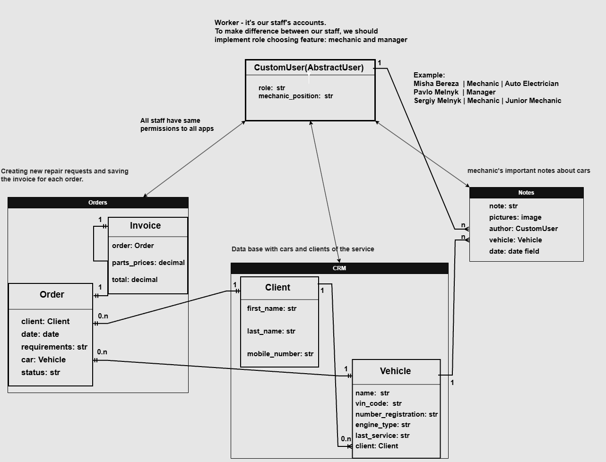
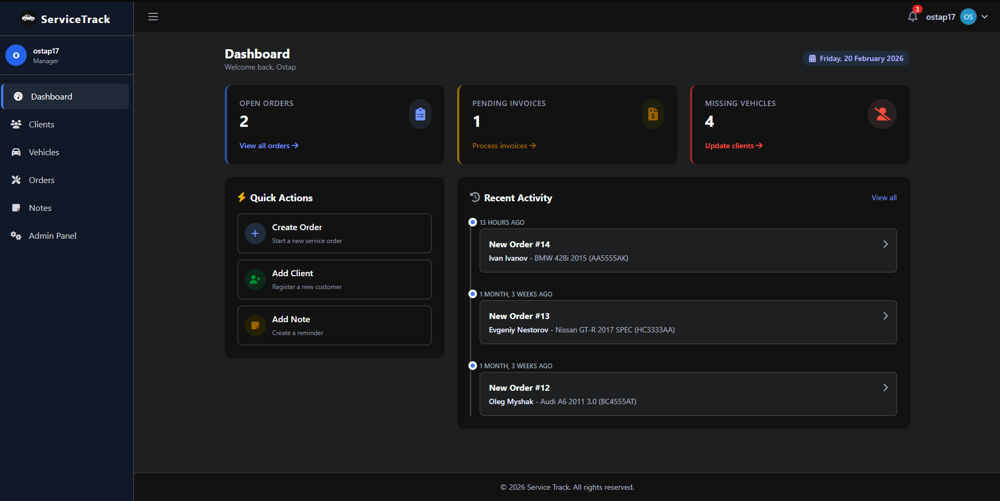
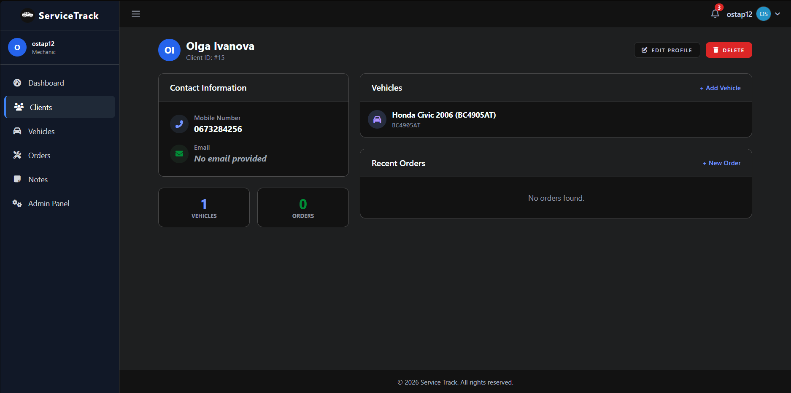

# Service Track (CRM)

Service track - is basic CRM system for businesses like Auto repair shop. 
Everything is done exclusively for the convenience of auto service employees.
The CRM system cannot be used or modified for other purposes.


## Installing / Getting started

A quick introduction of the minimal setup you need to get a hello world up &
running.

```shell
git clone https://github.com/ostapshpeha/py-service-track.git
cd service-track
python3 -m venv venv
source venv/bin/activate
pip install -r requirements.txt

python manage.py migrate
python manage.py createsuperuser # creating admin
python manage.py runserver # open test django server
```

## Project architecture:



### Tech stack

Main tools for developing this project:

- **Backend:** Python 3, Django 6.0
- **Frontend:** HTMX, Tailwind CSS, AdminLTE 3
- **Database:** SQLite (Dev), PostgreSQL (Prod)
- **Utilities:** 
    - django-filter
    - django-simple-history
    - django-crispy-forms
    - cloudinary

```
Mechanic (Permissions: CRUD for everything, can't create accounts):
Username: borys_ivanov
Password: Qwerty2002

Manager (Permissions: CRUD for everything and creating accounts for workers):
Username: kyrylo_budanov
Password: Qwerty2002
```

## Features

*  Easy orders management system
*  Clients and vehicles tracking
*  Notes from mechanics with image attachments
*  Search and filtering
*  Employee activity tracker from admin panel (Django history)
*  Registration only via admin panel
*  Easy admin dashboard (From template - AdminLTE 3)
*  User friendly interface

##  Configuration

The project uses standard Django configuration via settings and environment variables.

### Environment Variables

| Variable      | Type    | Default | Description |
|---------------|---------|---------|-------------|
| `DEBUG`       | Boolean | `True`  | Enables debug mode |
| `SECRET_KEY`  | String  | —       | Django secret key |
| `DATABASE_URL`| String  | —       | Database connection string |
| `ALLOWED_HOSTS` | String | `*` | Allowed hosts list |

Example `.env` file:

```env
# Cloudinary
CLOUDINARY_CLOUD_NAME=
CLOUDINARY_API_KEY=
CLOUDINARY_API_SECRET=

# django settings
DJANGO_SECRET_KEY=<secret_key>
DJANGO_SETTINGS_MODULE=<path_to_settings_file>
RENDER_EXTERNAL_HOSTNAME=<domain>

# database
POSTGRES_DB=<db_name>
POSTGRES_DB_PORT=<db_port>
POSTGRES_USER=<db_user>
POSTGRES_PASSWORD=<db_password>
POSTGRES_HOST=<db_host>
```

## Contributing

Contributions are welcome and appreciated.

If you want to contribute:

- Fork the repository
- Create a feature branch (git checkout -b feature/my-feature)
- Commit your changes
- Push to your fork
- Open a Pull Request
- Please follow the existing code style and make sure tests pass before submitting.

## Links

- Project homepage: https://github.com/ostapshpeha/py-service-track
- Repository: https://github.com/ostapshpeha/py-service-track.git
- Issue tracker: https://github.com/ostapshpeha/py-service-track/issues
  - In case of sensitive bugs like security vulnerabilities, please contact
    stark.ost17@gmail.com directly instead of using issue tracker.

Beta version of CRM:



